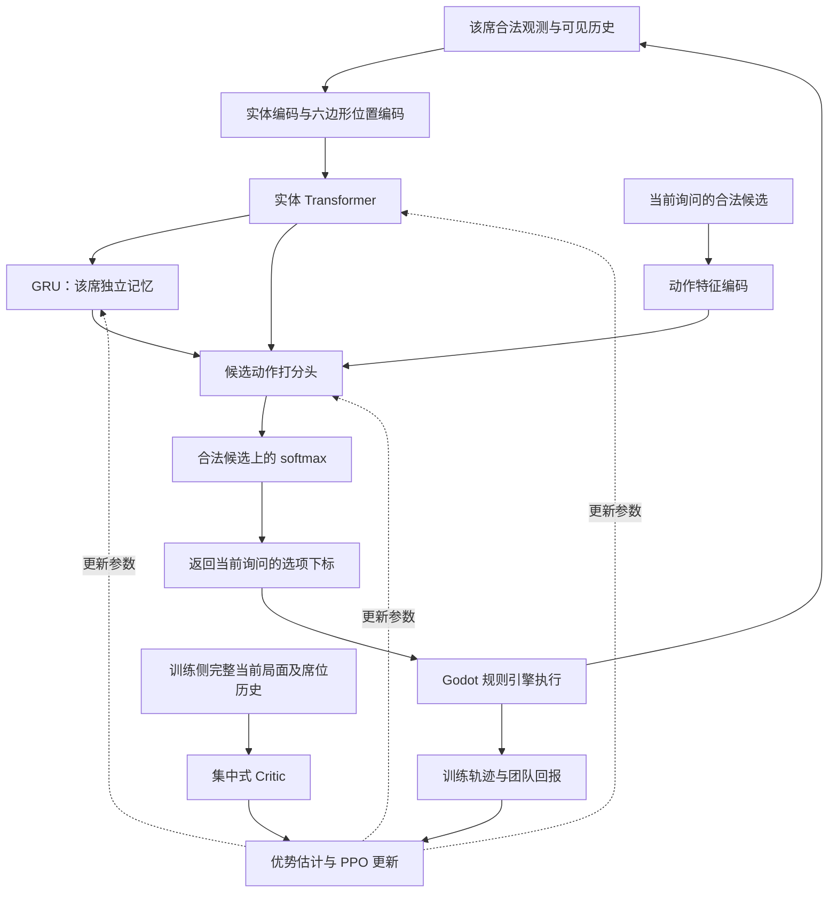

# Cell War：RL 策略架构设计建议

日期：2026-09-10

状态：研究提案，尚未实现；模型尺寸与训练配置均需实验验证。

代码核对基线：`7ef5bd0`；后续规则更新需重新确认观测、动作与评测协议。

## 1. 目标与推荐结论

团队目标是通过多智能体自博弈提高策略上限，训练可使用云端 GPU。建议主线为：

**带六边形位置编码的实体 Transformer + GRU 席位记忆 + 动态合法动作策略头，以 Recurrent PPO / MAPPO 风格的集中训练、分散执行方式训练，并配合策略联盟自博弈。**

免疫方与癌方各训练一套策略网络，同阵营席位共享网络参数，每个席位保留独立记忆。第一阶段固定四人局与规则版本；跑通训练、形成可信评测后，再扩展六人局及搜索增强。

这是根据 Cell War 特性提出的工程选型，不代表该组合已被证明最优。应保留更轻网络和 Recurrent IPPO 等同预算对照。

## 2. 游戏特性如何影响选型

- **六边形空间关系**：正式棋盘 127 格；邻接、方向、范围、连通块和特殊组织位置都会影响策略。
- **实体与效果种类多**：组织、细胞、手牌、装备、修饰和世界事件共同决定局面。
- **部分可观测**：每席能看公开棋盘和自己的手牌，其他席位的手牌隐藏，包含队友手牌。
- **团队对抗**：同阵营共享胜负目标，阵营之间对抗；不能将同队多个私有信息席位直接合并成读取全部手牌的单一决策者。
- **轮流且不等间隔决策**：一次行动可能触发多个中途询问，询问对象还可能切换到其他玩家。
- **随机与长期回报**：骰子、抽卡和世界事件引入不确定性，短期占地或能量优势不必然对应最终胜利。
- **合法动作随局面变化**：引擎已经枚举当前合法选项，适合逐候选打分。

## 3. 模型总结构

Actor 是实际出招的策略网络；Critic 是训练时估计回报的评分网络。部署策略时不需要集中式 Critic。

### 3.1 输入：结构化观测

直接读取引擎状态构建特征，不需要截图识别。建议包含：

- **组织 token**：轴坐标、组织类别、特殊组织类别、固化进度、库存及影响规则的状态。
- **细胞 token**：位置、阵营、玩家归属、类型、能量、存活状态、公开装备与修饰、次数限制等。
- **自己的手牌 token**：结构化卡牌 ID、类别和规则参数；保留重复卡牌的可选择身份。
- **其他席位的可见摘要**：手牌数量和公开行为，不输入真实隐藏牌名。
- **全局与询问上下文**：人数、世界回合、阶段、当前受询问席位、阵营状态、公开世界事件、`req.kind` 及结构化结算上下文。
- **可见历史**：公开出牌、移动、死亡、效果消耗等事件，以及该席自己的私有观察。

正式棋盘用 127 个组织 token；教程或其他尺寸通过有效位 mask 处理。变化的细胞数、手牌数和候选数采用变长表示或批次填充，不预设尚未验证的数量上限。

数字特征需要统一单位与缩放。引擎继续以十分能量整数结算；模型输入可缩放为浮点，但不能将规则相关信息静默截断。

Actor 的信息边界参考 [CWNet.view_for / logs_for](../game/scripts/net/cw_net.gd)，编码器应使用明确的字段白名单。不能直接把完整 `snapshot()` 输入 Actor，也不能输入 RNG 状态、未公开牌表或未来随机结果。

### 3.2 空间编码：实体 Transformer

各类实体先经过各自的小型特征编码层，映射到统一维度，再交给 Transformer 学习实体之间的关系。

建议起始配置：

- Transformer：4 层，隐藏维度 256，8 个注意力头，前馈层宽度 1024。
- 位置特征：轴坐标与实体类型；空间实体间加入六边形相对距离、方向或相对坐标偏置。
- 卡牌通过归属关系关联到细胞；全局上下文通过全局 token 或上下文向量提供。

该结构适合同时表达局部交战、远处队友支援、资源争夺与卡牌配合。AlphaStar 使用过实体 Transformer 与循环记忆的组合，可作为方向参考，但上述尺寸是本项目的待验证起点。[1]

GNN 是合理备选，适合通过六邻接图传递信息；CNN 也可使用轴坐标布局和六邻域卷积。必须比较相同训练样本预算与墙钟预算下的效果，不预先断言 Transformer 一定胜出，也不在第一版同时堆叠 GNN 和 Transformer。

### 3.3 时间编码：GRU 席位记忆

建议在当前局面摘要后接一层隐藏维度为 256 的 GRU，保存每席可观察历史。

**共享权重不等于共享记忆。** 同阵营席位使用同一 Actor 参数，但每局每席分别维护 hidden state；不能把队友私有观察写入其他席位的记忆。

记忆需要接收该席能观察到的中间事件，不能只在再次轮到它选择时提供最终棋盘。训练应使用连续序列、正确的重置 mask 和必要的 burn-in；不能把带记忆轨迹随机打散为互不关联的单帧。细胞死亡或复活不等于玩家失去过去记忆，通常不应因此清空席位状态。

第一组消融应比较有无 GRU。更长上下文的时序 Transformer 可以作为后续研究方向。

### 3.4 输出：动态合法候选打分

以 [CWBridge.ask(req)](../game/scripts/core/cw_bridge.gd) 提供的 `req.options` 为候选集。对每个候选编码：

- 询问类型和动作类型；
- 来源、目标格与目标细胞；
- 卡牌或技能身份；
- 费用、数量、方向、停止或放弃等结构化参数。

再结合局面表示和该席记忆生成一个分数：

`score_i = MLP(局面摘要, 席位记忆, 候选特征_i, 候选关联实体表示_i)`

`π(i | 观测历史, 合法候选集) = softmax(score)_i`

只在合法候选上采样；批次填充项必须屏蔽。训练与推理使用一致的候选编码和 mask。合法动作屏蔽的策略梯度依据见文献 [2]。

模型学习候选语义，选项下标只用于把答案交回引擎。不能把下标当固定动作 ID，也不能假设第 0 项永远是停止。应按 `data.stop`、`data.skip` 等实际语义处理，并以询问编号防止旧答案进入新问题。

先测量候选数量分布。只有候选组合确实过大时，再考虑分解为“动作类型 → 目标 → 参数”的自回归策略头。

## 4. 多智能体训练

### 4.1 阵营内共享参数

初始设计为两套 Actor：免疫 Actor 与癌 Actor。同阵营不同席位共享其参数，输入包含自己的身份、细胞类型及当前询问上下文。

两阵营规则和行动存在明显差异，分别训练便于调试及分析。统一网络加阵营条件作为后续消融，不需要给每种细胞或每个座位单独训练一套模型。

### 4.2 集中训练、分散执行（CTDE）

每阵营配置独立的集中式 Critic，估计该阵营在当前训练策略分布下的预期回报。输入可包括完整当前局面、当前受询问席位、必要的观察历史或记忆上下文。

训练侧可以使用当前隐藏手牌帮助估值，但 Actor 与 Critic 的输入通路必须分开；不要共享会把特权特征带入 Actor 的隐状态。即使是 Critic，也不输入 RNG 或未来抽牌、骰子结果。

同阵营以团队胜负作为核心目标。建议从带记忆的 PPO / MAPPO 风格算法开始，同时实现 Recurrent IPPO 基线，判断集中式 Critic 是否确实提升样本效率和稳定性。MAPPO 原论文的主要证据来自共享回报的合作环境，不能直接视为本项目团队对抗的最优性证明。[3]

### 4.3 奖励与决策时间

先以终局团队胜负 `+1 / -1` 为核心回报。若稀疏奖励难以学习，再加入受控奖励塑形，并做去除塑形的评测；不要把现有启发式估值长期当作最终目标。

每席两次决策之间可能隔着多名玩家行动，也可能只是同一次技能里的追加询问。需要累计期间奖励，明确折扣基于什么游戏时间；追加菜单选择不应凭空消耗一个世界回合的折扣。死亡罚停不等于席位 episode 结束，终局团队奖励仍需归属到其此前决策。

### 4.4 策略联盟自博弈

第一版维护当前主策略和历史冻结策略池。采样一局时固定所用策略版本，并记录到轨迹；后续加入专门寻找主策略弱点的 exploiter，以及不同历史版本的队友组合。

该机制旨在缓解只对最新自己训练产生的循环克制、遗忘与配合过拟合。AlphaStar 的联盟训练可作为参考，但其结果还依赖模仿学习与大规模训练，不能直接推断本项目的收益。[4]

PPO 更新使用符合其采样策略与概率记录要求的轨迹。历史策略池是对手来源，不意味着可以把任意旧轨迹直接当当前 on-policy 数据反复训练。

## 5. 与现有工程的连接

### 5.1 保留 Godot 规则引擎

采样端运行无头 Godot，多进程并行对局；Python 侧负责模型、批量推理、轨迹处理和优化。通信协议随后依据吞吐测试选择，第一版不复制一套 Python 游戏规则。

这样规则结算、随机、费用、伤害、胜负和回放仍由当前引擎负责，避免训练环境与玩家版本逐渐分叉。

### 5.2 每次 ask 都属于环境决策

[CWGame.pending / step](../game/scripts/core/cw_game.gd) 处理顶层推进，而动作结算中还会直接 `await game.ask(...)`。RL 适配应新增决策桥，在每次询问上输出观测和候选，等待答案，再恢复原协程。

因此不能只包装顶层 `pending()/step()`。必须覆盖开局、复活、行动、卡牌和技能的追加选择，并使用 **`req.pid`** 路由 Actor、观测、记忆及轨迹归属。一次外层 `step()` 可能包含多个席位的选择。

当前快照不保存任意卡牌协程的调用栈。第一版采样保持协程存活；需要把剩余次数等中途语义补成结构化结算上下文。若后续要求在任意追加询问处进行搜索或恢复，再将这些 continuation 转成可序列化流程状态。

### 5.3 现有 NN 插槽与搜索

[CWNNLeafValue](../game/scripts/ai/cw_leaf_value_nn.gd) 当前仍回退到经典估值；它提供的是叶子标量评分接口，不包含策略输出、观测编码或训练流程。

[CWMCTSBridge](../game/scripts/ai/mcts_bridge.gd) 从完整快照构建推演局面。将来用于公平信息条件下的搜索或专家数据前，需要核对隐藏信息边界、对手节点的选择视角和随机结果处理，不能仅替换叶子评分器就视为完成 RL 自博弈。

PPO Critic 输出的是预期回报；存在折扣或奖励塑形时，它不自动等于 NN 插槽要求的根阵营胜率 `[0,1]`。用于搜索前应单独定义并验证价值语义。带记忆模型的缓存还取决于视角、可见历史与模型版本，不能只用 `state_hash()`。

## 6. 为什么不先直接套 AlphaZero 或 Deep CFR

AlphaZero 的经典应用是完全信息棋类。[5] Cell War 的随机性可以通过机会结果建模，但隐藏手牌与队友私有信息还要求信息集或信念建模。简单地读取完整快照搜索会超出玩家信息权限；仅随机补一份隐藏牌，也可能产生同一信息集下不一致的决策。

策略基线成熟后，可以研究信念采样、信息集搜索与策略/价值引导的组合，并以相同信息权限和计算预算验证收益。信息集 MCTS 可作为相关起点。[6]

NFSP、Deep CFR 值得在缩小棋盘、减少卡牌的二人版本中作为研究对照。[7][8] 当前多席团队具有分散的私有信息，标准二人零和方法的均衡保证不能直接套用；构造信息集、反事实价值及树遍历的工程成本也应纳入选型。

## 7. 实施顺序与验证标准

1. **训练环境适配**：覆盖所有询问、按席隔离观测、关闭表现层等待。验证同种子与相同选择可复现，追加询问不遗漏，轨迹归属正确，终局与回放一致。
2. **四人局学习基线**：固定规则版本，跑通轻量网络与带记忆 PPO。用多个训练随机种子确认稳定性，测候选数、环境吞吐及推理时延。
3. **建立策略池**：加入历史冻结对手，随后加入 exploiters 和队友混合。验证对保留对手的表现，而不只看训练回报。
4. **架构消融**：比较 Transformer 与 GNN/CNN、有无 GRU、集中式 Critic 与 IPPO、两阵营分网与统一条件网络。分别控制环境样本预算和墙钟预算。
5. **扩展六人模式**：输入加入人数条件，覆盖席位与癌种组合，分别报告四人、六人的结果，检查是否损害已学会的四人策略。
6. **可选搜索增强与部署**：先解决信息集和价值语义，再比较纯策略与搜索版本在同等信息、时延预算下的效果。

评测至少包括保留随机种子、阵营与座位交换、历史策略对战矩阵、胜率置信区间及队友交叉配对。现有启发式、MC、MCTS 可以参与比较，但需标明各自的信息权限；对全信息对手的胜率不能混作公平信息下的强度指标。

训练回报或 Elo 上升不能单独证明稳健，更不能证明接近 Nash 均衡。最终判据应是对保留对手分布和针对性挑战持续有效。

## 8. 算力与实验记录

先测无头 Godot 的 `decisions/s`、CPU 利用率、GPU 批量推理吞吐和训练耗时，再决定扩展哪类资源。云 GPU 可用并不意味着采样端不会成为瓶颈；当前不承诺训练天数、租用费用或最终胜率。

每次实验记录代码提交、规则旋钮签名、观测/动作协议版本、模型配置、训练随机种子、对手池版本、环境样本数、墙钟时间与评测集。规则改动后重新确定实验基线，不能直接把不同规则版本的胜率混合比较。

本提案尚未决定具体 RL 框架、进程通信方案、优化超参数、对手采样比例或部署推理后端；这些应在环境接通和吞吐基准完成后确定。

## 9. 参考资料

以下来源支持方法方向；文中的 Cell War 网络结构与实施路线属于针对本项目的建议。

1. [AlphaStar: Mastering the real-time strategy game StarCraft II](https://deepmind.google/blog/alphastar-mastering-the-real-time-strategy-game-starcraft-ii/)：实体 Transformer、循环记忆及策略输出的设计参考。
2. [A Closer Look at Invalid Action Masking in Policy Gradient Algorithms](https://arxiv.org/abs/2006.14171)：策略梯度中的非法动作屏蔽。
3. [The Surprising Effectiveness of PPO in Cooperative, Multi-Agent Games](https://arxiv.org/abs/2103.01955)：MAPPO 与合作多智能体 PPO 的实证基线。
4. [AlphaStar: Grandmaster level in StarCraft II using multi-agent reinforcement learning](https://deepmind.google/blog/alphastar-grandmaster-level-in-starcraft-ii-using-multi-agent-reinforcement-learning/)：策略联盟、历史对手和 exploiter。
5. [Mastering Chess and Shogi by Self-Play with a General Reinforcement Learning Algorithm](https://arxiv.org/abs/1712.01815)：AlphaZero 的完全信息棋类应用。
6. [Information Set Monte Carlo Tree Search](https://eprints.whiterose.ac.uk/id/eprint/75048/)：不完全信息下的搜索。
7. [Deep Reinforcement Learning from Self-Play in Imperfect-Information Games](https://arxiv.org/abs/1603.01121)：NFSP。
8. [Deep Counterfactual Regret Minimization](https://arxiv.org/abs/1811.00164)：Deep CFR。
